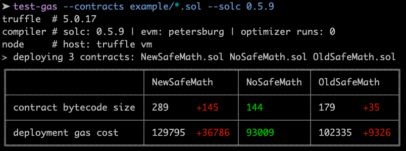
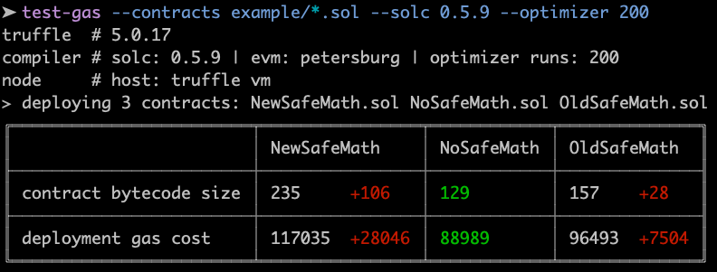
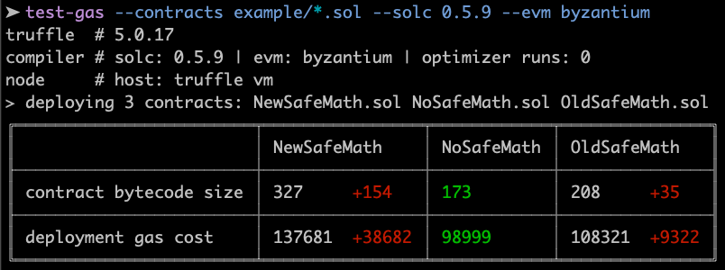

[](https://www.npmjs.com/package/test-gas)


# test-gas

cli tool to compare gas cost of deploying contracts and executing functions

## Depenencies

- [`argparse`](https://www.npmjs.com/package/argparse), to parse cli args.
- [`chalk`](https://www.npmjs.com/package/chalk), to colorize table output.
- [`fs-plus`](https://www.npmjs.com/package/fs-plus), enhanced `fs`, to ease working with filesystem.
- [`table`](https://www.npmjs.com/package/table), to generate ascii table.
- [`truffle`](https://www.npmjs.com/package/truffle), to deploy/test smart contracts.
- [`evm`](https://www.npmjs.com/package/evm), to disassemble contract bytecode.


## Install 

```
npm i -g test-gas
```

or execute without install:

```
npx test-gas
```

## Usage 

```
Command:
  test-gas <required args> [optional args]

Required arguments:
  --contracts [<path> ...]    solidity test file glob path, e.g. ./contracts/*.sol
  --solc <version>            solc version to use, e.g. 0.5.6

Optional arguments:
  --function <function()>     function to call, e.g. 'testFn(2)'
  --evm <version>             evm version to use, e.g. petersburg
  --optimizer <runs>          number of optimizer runs, e.g. 200
  --store-opcodes <dir path>  directory to write contract opcodes to
  --node-host <host>          host/ip address of ethereum node
  --node-port <port>          port of ethereum node
  --node-id <id>              network id of ethereum node
  --node-gas <gaslimit>       ethereum network gas limit
  --node-websockets           use websockets of ethereum node
  
Other:
  -h, --help                  show this help message and exit.
  -v, --version               show program's version number and exit. 
```

## Examples

See the `example` directory for some sample contracts which compare using no vs old vs new OpenZeppelin SafeMath.

Sample commands:
- use truffle internal development EVM node (is the default)

  `test-gas --contracts example/*.sol --solc 0.5.9`
  
  

- enable and set the optimizer

  `test-gas --contracts example/*.sol --solc 0.5.9 --optimizer 200`
  
  
  
- set specific evm version

  `test-gas --contracts example/*.sol --solc 0.5.9 --evm byzantium`
  
  `

- besides deploying, also call a function to compare execution gas cost

  `test-gas --contracts example/*.sol --solc 0.5.9 --function 'exec()'`
  
  
  
- use ganache/geth/parity node instead of truffle internal development EVM node

  `test-gas --contracts example/*.sol  --solc 0.5.9 --node-port 8545`
  
  
  
- also output disassembly of each contract

  `test-gas --contracts example/*.sol --solc 0.5.9 --disassemble ./output_disassembly`
  
  creates one disassembly file per contract inside `./output_disassembly`. The `NoSafeMath` one is shown here:
  
  ```
  0 PUSH1 0x80
  2 PUSH1 0x40
  4 MSTORE
  5 CALLVALUE
  6 DUP1
  7 ISZERO
  8 PUSH1 0xf # == 15
  10 JUMPI
  11 PUSH1 0x00
  13 DUP1
  14 REVERT

  15 JUMPDEST
  16 POP
  17 PUSH1 0x4
  19 CALLDATASIZE
  20 LT
  21 PUSH1 0x28 # == 40
  23 JUMPI
  24 PUSH1 0x00
  26 CALLDATALOAD
  27 PUSH1 0xe0
  29 SHR
  30 DUP1
  31 PUSH4 0xf873cb91
  36 EQ
  37 PUSH1 0x2d # == 45
  39 JUMPI

  40 JUMPDEST
  41 PUSH1 0x00
  43 DUP1
  44 REVERT

  45 JUMPDEST
  46 PUSH1 0x56 # == 86
  48 PUSH1 0x4
  50 DUP1
  51 CALLDATASIZE
  52 SUB
  53 PUSH1 0x20
  55 DUP2
  56 LT
  57 ISZERO
  58 PUSH1 0x41 # == 65
  60 JUMPI
  61 PUSH1 0x00
  63 DUP1
  64 REVERT

  65 JUMPDEST
  66 DUP2
  67 ADD
  68 SWAP1
  69 DUP1
  70 DUP1
  71 CALLDATALOAD
  72 SWAP1
  73 PUSH1 0x20
  75 ADD
  76 SWAP1
  77 SWAP3
  78 SWAP2
  79 SWAP1
  80 POP
  81 POP
  82 POP
  83 PUSH1 0x58 # == 88
  85 JUMP

  86 JUMPDEST
  87 STOP

  88 JUMPDEST
  89 POP
  90 JUMP
  91 INVALID
  92 LOG2
  93 PUSH6 0x627a7a723058
  100 SHA3
  101 INVALID
  102 PC
  103 INVALID
  104 PUSH16 0xe87b98cc0b49333cbfe769a4553bb44
  121 INVALID
  122 INVALID
  123 PUSH20 0x85e1fa42beff1c169f64736f6c634300590032
  ```
  
## License

MIT